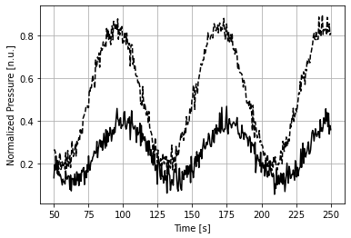
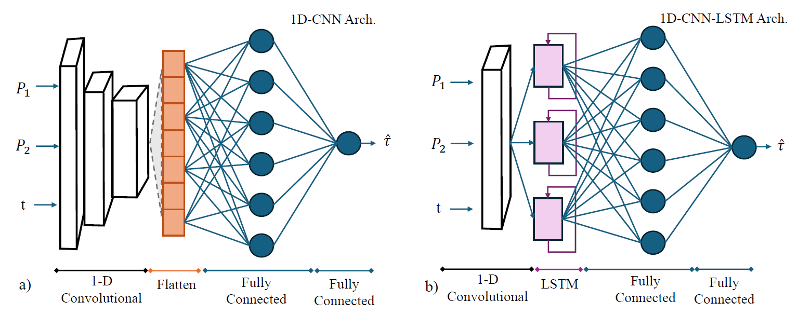

# Newtonian Viscosity Sensing from Pressure Signals through Edge Deep Learning - A Microfluidic Device
 Research for the estimation of viscosity based on temporal response of a microfluidic RC circuit. This repository includes all the code used for simulating, data curation, training, and benchmark production.

 The details of the analytic model developed for this research can be found at the original research paper. This model has been implemented and simulated (purely with Python) and the simulations look like this example:

 

 Squared, sinusoidal, triangular and daubechies-5 signals were used as input pressure signals to the model of the viscometer in order to generate the expected output signals. These output signals comes from two pressure sensors placed at the inlet of the viscometer and at the outlet of the capacitance. From the transformation of this signal we can understand the viscosity of the fluid. How? We use a parameters identification algorithm to estimate the time-constant, $\tau$, of the system. This time constant is then used together to our knowledge of the system to calculate the viscosity as follows:

 $\mu = \tau \frac{(R_{g,1} + R_{g,2})}{(R_{g,1} R_{g,2} C)}$

 Among the identification algorithms, we study two deep learning models. The point is that these models might transform the (usually) iterative problem of the identification algorithm (N4SID or FROLS) into a nonlinear mapping function. This might be faster in some situations. 

 The artificial neural networks, that you can observe below, have been implemented using TensorFlow.
 

We also quantize the proposed models so they can run embedded in microcontrollers. This quantization affects the accuracy of the models, but greatly reduces the inference time. Sometimes, 200 faster than the original model.

To validate the approach, we also built a prototype whose data can be found together with the synthetic data. The dataset can be downloaded from Zenodo at: https://doi.org/10.5281/zenodo.14811969
